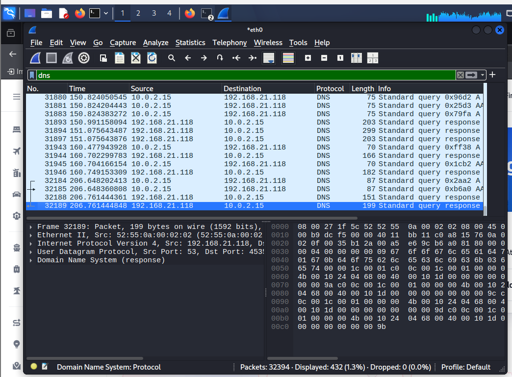
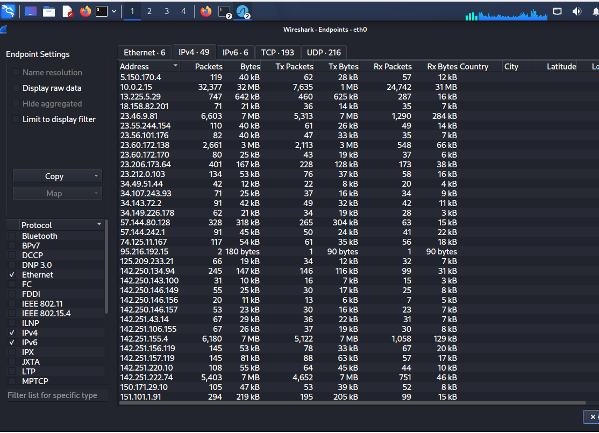
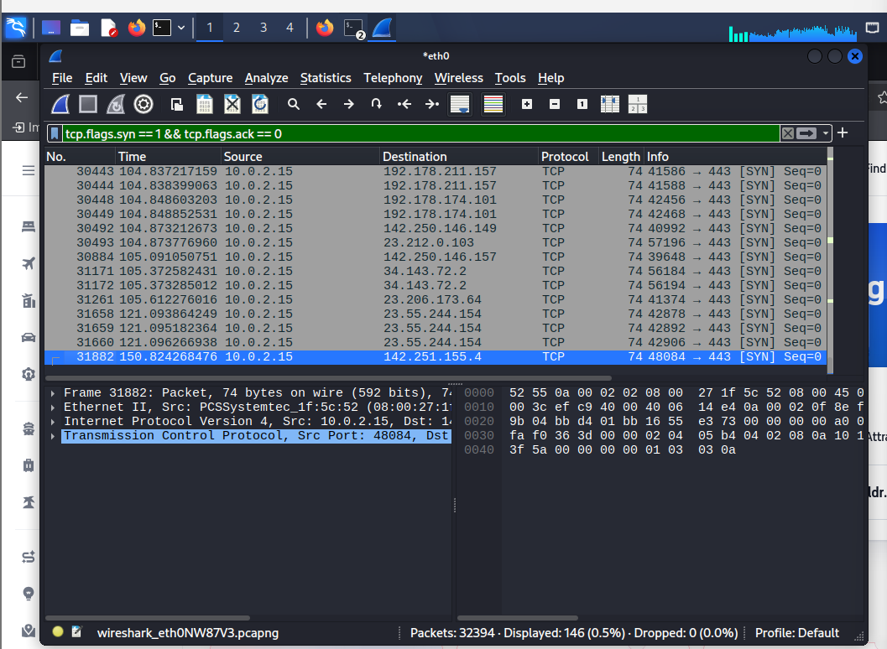
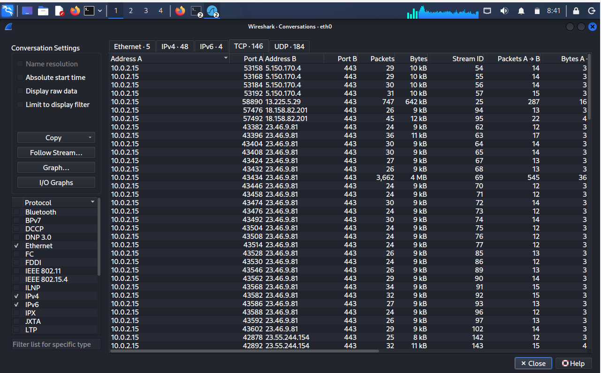
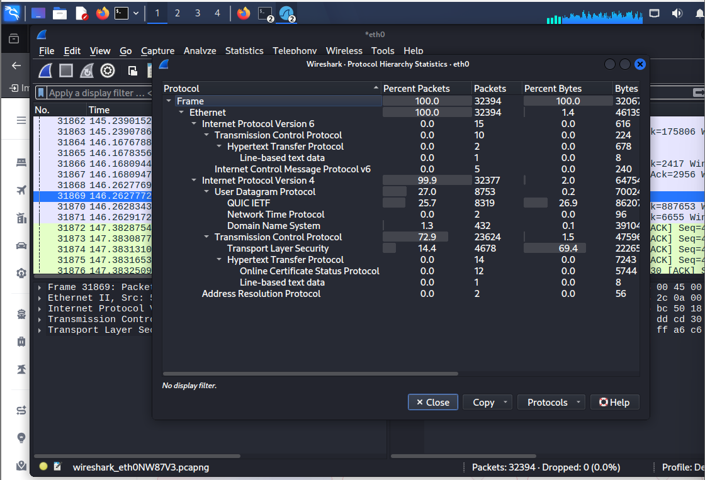
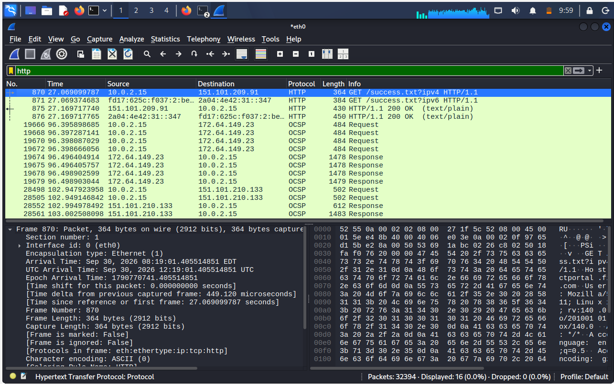

# Network Traffic Analysis using Wireshark

## Project Overview

This project demonstrates network traffic analysis using Wireshark. The captured network traffic was analyzed to understand different protocols, endpoints, TCP connections, conversations, and HTTP traffic.

## Objectives

- Analyze captured network packets using Wireshark
- Identify commonly used network protocols
- Analyze DNS traffic
- Identify top network endpoints
- Analyze TCP connections and conversations
- Examine protocol hierarchy
- Analyze HTTP traffic
- Understand network communication patterns

## Tools Used

- Wireshark
- Kali Linux
- PCAP Network Capture

## Analysis Performed

### 1. DNS Analysis

DNS traffic was analyzed to observe DNS queries and responses between the local system and DNS servers.

### 2. Top Talkers / Endpoints

The endpoints statistics were analyzed to identify systems communicating on the network and the amount of traffic exchanged.

### 3. TCP Connections Analysis

TCP connections were analyzed to understand communication between the local system and remote servers using TCP.

### 4. TCP Conversations

TCP conversations were examined to understand packet exchange, ports, packet counts, and data transfer between communicating endpoints.

### 5. Protocol Hierarchy

The protocol hierarchy was analyzed to identify the protocols present in the captured network traffic and their contribution to the overall traffic.

### 6. HTTP Traffic Analysis

HTTP traffic was filtered and analyzed to observe HTTP requests and responses in the captured traffic.

## Key Observations

- DNS queries and responses were observed during the capture.
- Multiple network endpoints communicated with the local system.
- TCP connections were established with different remote servers.
- TCP conversations showed packet and byte exchange between endpoints.
- The protocol hierarchy showed the distribution of different protocols in the capture.
- HTTP requests and responses were identified using the HTTP display filter.

## Conclusion

This project provides practical experience in analyzing network traffic using Wireshark. It demonstrates how packet captures can be examined to understand network communication, protocols, endpoints, and traffic patterns.
